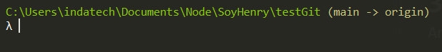
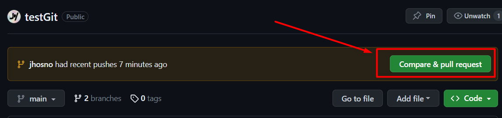
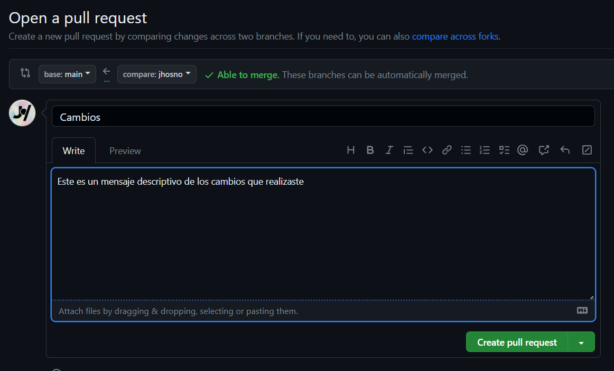

[Vídeo de GitFlow de Henry](https://vimeo.com/567639276/e365c11ede)

Holis!😃😃
Te he dejado una pequeña actividad para que todos podamos practicar _**git branch**_ y _**pull request**_. Este es un repo con un pequeño proyecto de react + [vite](https://vitejs.dev).

>⚡Vite⚡ es una herramienta frontend para ver cambios y buildear más rápidos. 


### Consideraciones previas 👀
Es ⚠importante⚠ que cada componente que creemos en el marco de vite debe tener la extension _**.jsx**_, sino, no va a funcionar la app

Así que vamos a ello:

✌🚀

## Manejo de básico ramas en Git
Lo primero que vamos hacer es conocer alguno de los comandos para manejar branch:

1. Ver todas las branches
```shell
git branch 
```
2. Ver todas las branches (locales y remotas )
```shell
git branch -a
```
3. Cambiar a una rama especifica
```shell
git checkout <NOMBRE-RAMA>
```
4. Crear una nueva rama
```shell
git branch NOMBRE-NUEVA-RAMA
```
5. Crear una nueva rama y cambiarse a esta nueva rama (atajo)
```shell
git checkout -b NOMBRE-NUEVA-RAMA
```

## 1. Creemos una nueva rama para esta asignación
Empecemos con crear una nueva rama en el proyecto.

> ⚠**Recuerda**⚠ que este deber el primer paso, por que todos los cambios que hagas en una rama, se van a quedar en esa rama, y a la larga eso puede ser problemático.

Para el ejercicios vamos a poner tu nombre a la rama. posicionamos la consola encima de la carpeta del proyecto y tipeamos el comando
```shell
git checkout -b <TU-NOMBRE>
```

## 2. Crear un nuevo componente
En la carpeta ./src/components vamos a crear un componente con tu nombre, debería verse así, sencillo por que el punto es practicar GitFlow.

src/components/Jhosno.jsx
```jsx
function Jhosno() {
  return (
    <div>Jhosno</div>
  )
}

export default Jhosno
```

>👁‍🗨**Recuerda**👁‍🗨: los componentes deben tener la extensión **.jsx** 

De una vez vamos a exportarlo a **/App.js** y chequear que los cambios funcionen en el localhost
```jsx
import "./App.css";
import Jhosno from "./Components/Jhosno";
import TuNombre from "./Components/TuNombre";
  
function App() {
  return (
    <>
      <Jhosno/>
      <TuNombre/>
    </>
  );
}

export default App;
```

## 3. Subir los cambios
Antes vamos a asegurarnos de que estamos posicionados en la rama correcta, para ello nos revisamos que nuestra consola no diga **main->Origin** (puede que este se muestre de forma diferente en tu consola. Recuerda que somos un equipo y puedes hacer todas las consultas que necesites)


Sino es el caso, recuerda que puedes listar las branches con 
```shell
git branch 
```
y pasarte a tu branch con:
```shell
git checkout <NOMBRE-RAMA>
```
Una vez, posicionado en la rama correcta, hacemos el **git push** de toda la vida 
```shell
git add . 
git commit -m"mensaje de commit"
git push
```

## 4.PullRequest

Ahora vamos a la página del repo en github, en la página principal vas a ver la opción _**Compare & pull request***_



El siguiente paso será llenar un título y una pequeña descripción. Ya una vez lleno esto le damos al botón **Create pull Request** 


Ya con esto dejas listo tu **pull request**, listo para revisar y hacer merge

😎✌